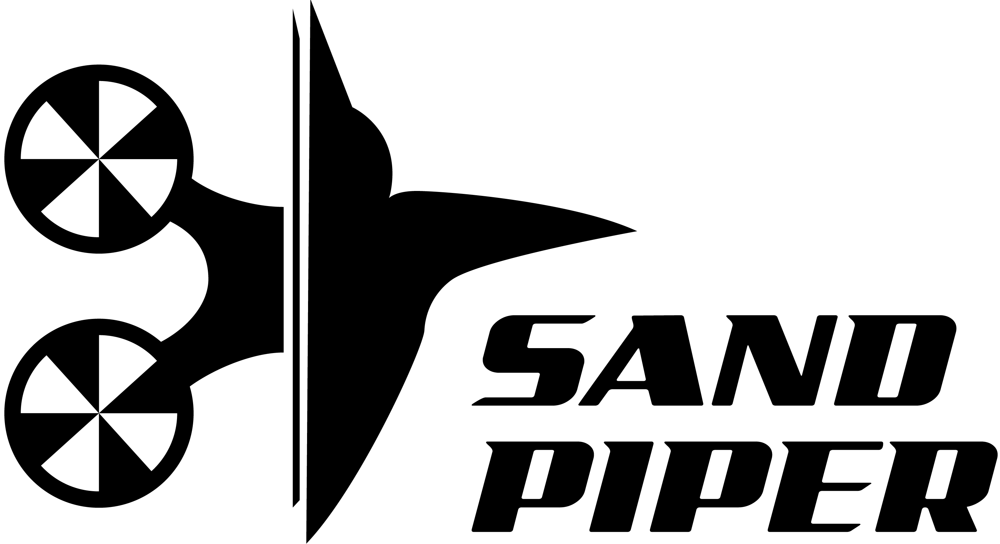

<!-- PROJECT SHIELDS -->
<!--
*** I'm using markdown "reference style" links for readability.
*** Reference links are enclosed in brackets [ ] instead of parentheses ( ).
*** See the bottom of this document for the declaration of the reference variables
*** for contributors-url, forks-url, etc. This is an optional, concise syntax you may use.
*** https://www.markdownguide.org/basic-syntax/#reference-style-links
-->
[![Contributors][contributors-shield]][contributors-url]
[![Forks][forks-shield]][forks-url]
[![Stargazers][stars-shield]][stars-url]
[![Issues][issues-shield]][issues-url]

[![LinkedIn][linkedin-shield]][linkedin-url]

<!-- PROJECT logo -->
 

  

  <h3 align="center">- Tools for automatic UAV-SfM beach volumetric and behavioural analysis -</h3>
   Tools for automatic UAV-SfM beach volumetric and behavioural analysis
  
 

<!-- MARKDOWN LINKS & IMAGES -->
<!-- https://www.markdownguide.org/basic-syntax/#reference-style-links -->
[contributors-shield]: https://img.shields.io/github/contributors/npucino/sandpiper.svg?style=for-the-badge
[contributors-url]: https://github.com/npucino/sandpiper/graphs/contributors
[forks-shield]: https://img.shields.io/github/forks/npucino/sandpiper.svg?style=for-the-badge
[forks-url]: https://github.com/npucino/sandpiper/network/members
[stars-shield]: https://img.shields.io/github/stars/npucino/sandpiper.svg?style=for-the-badge
[stars-url]: https://github.com/npucino/sandpiper/stargazers
[issues-shield]: https://img.shields.io/github/issues/npucino/sandpiper.svg?style=for-the-badge
[issues-url]: https://github.com/npucino/sandpiper/issues
[license-shield]: https://img.shields.io/github/license/npucino/sandpiper.svg?style=for-the-badge
[license-url]: https://github.com/npucino/sandpiper/blob/master/LICENSE 
[linkedin-shield]: https://img.shields.io/badge/-LinkedIn-black.svg?style=for-the-badge&logo=linkedin&colorB=555
[linkedin-url]: https://www.linkedin.com/in/nicolaspucino/

[Install Conda]:https://www.anaconda.com/products/individual "Anaconda download website"
